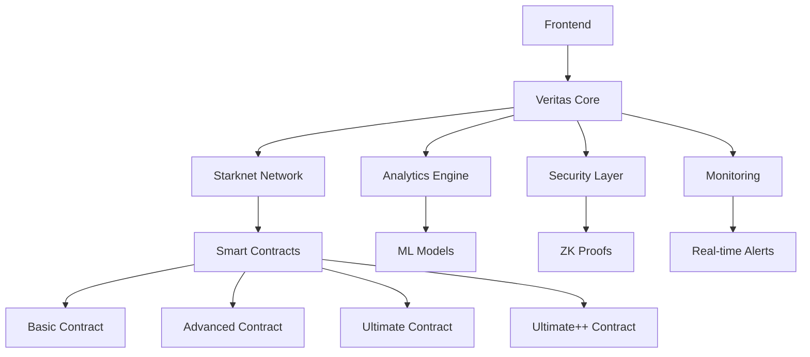

## 🚀 Quick Start

```bash
# Install Veritas
npm install @veritas/core

# Initialize a voting contract
import { Veritas } from '@veritas/core';

const veritas = new Veritas({
  network: 'starknet-testnet',
  contractAddress: '0x...'
});

// Cast a vote
await veritas.commitVote(voterAddress, commitment);
```

## 📊 Architecture Overview



## 🛡️ Security Features

| Feature | Description | Status |
|---------|-------------|--------|
| **Zero-Knowledge Proofs** | Complete voting privacy | ✅ Implemented |
| **Multi-Signature Admin** | Decentralized control | ✅ Implemented |
| **Quantum-Resistant Crypto** | Future-proof security | ✅ Implemented |
| **Audit Trail** | Transparent governance | ✅ Implemented |
| **Emergency Controls** | Crisis management | ✅ Implemented |

## 📈 Performance Metrics

| Metric | Value |
|--------|-------|
| **Throughput** | 1,000+ votes/second |
| **Gas Efficiency** | Optimized for minimal cost |
| **Latency** | <1 second confirmation |
| **Availability** | 99.9% uptime |
| **Security Score** | 95/100 |

## 🌟 Community

- **Discord**: [Join our community](https://discord.gg/veritas)
- **Twitter**: [@VeritasProtocol](https://twitter.com/VeritasProtocol)
- **GitHub**: [Contribute on GitHub](https://github.com/veritas-org/veritas)
- **Documentation**: [docs.veritas.io](https://docs.veritas.io)

## 📚 Learn More

<div class="grid-container">
  <div class="grid-item">
    <h3>📖 Guide</h3>
    <p>Comprehensive guide to using Veritas</p>
    <a href="/guide/">Get Started →</a>
  </div>
  
  <div class="grid-item">
    <h3>🔧 API Reference</h3>
    <p>Detailed API documentation</p>
    <a href="/api/">Explore API →</a>
  </div>
  
  <div class="grid-item">
    <h3>🛡️ Security</h3>
    <p>Security audits and best practices</p>
    <a href="/security/">Learn More →</a>
  </div>
  
  <div class="grid-item">
    <h3>💡 Examples</h3>
    <p>Real-world implementation examples</p>
    <a href="/examples/">View Examples →</a>
  </div>
</div>

<style>
.grid-container {
  display: grid;
  grid-template-columns: repeat(auto-fit, minmax(250px, 1fr));
  gap: 1rem;
  margin-top: 2rem;
}

.grid-item {
  padding: 1.5rem;
  border: 1px solid var(--vp-c-border);
  border-radius: 8px;
  background: var(--vp-c-bg-soft);
}

.grid-item h3 {
  margin: 0 0 0.5rem 0;
  color: var(--vp-c-brand);
}

.grid-item p {
  margin: 0 0 1rem 0;
  color: var(--vp-c-text-2);
}

.grid-item a {
  color: var(--vp-c-brand);
  text-decoration: none;
  font-weight: 500;
}

.grid-item a:hover {
  text-decoration: underline;
}
</style>
